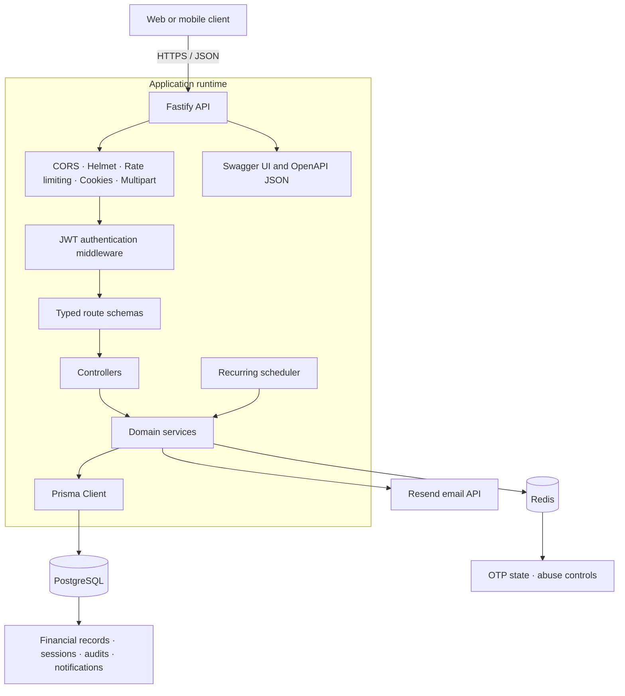
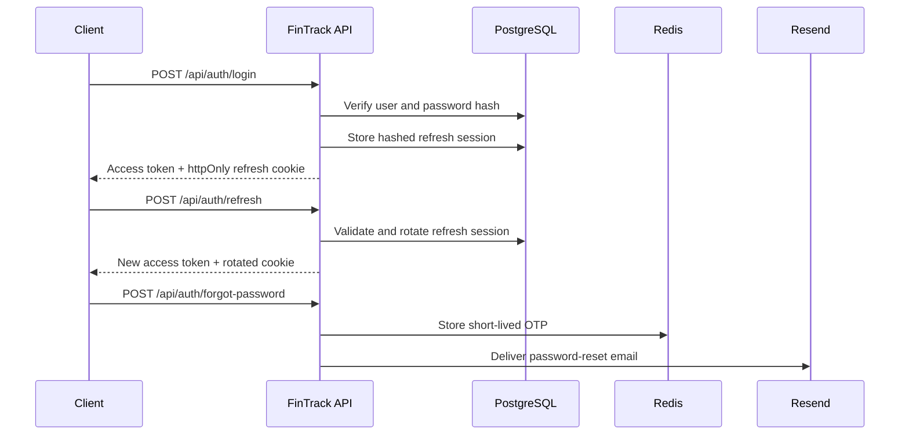

<div align="center">

# FinTrack API

### Production-oriented personal finance infrastructure for modern applications

[](https://github.com/isharax9/fintrack-api/actions/workflows/ci.yml)
[](https://nodejs.org/)
[](https://www.typescriptlang.org/)
[](https://fastify.dev/)
[](https://www.postgresql.org/)
[](https://redis.io/)
[](https://www.prisma.io/)
[](https://www.docker.com/)

**FinTrack API is a typed REST backend for accounts, transactions, transfers, budgets, savings, recurring payments, reporting, imports, exports, notifications, and audit history.**

[Quick start](#-quick-start) · [API documentation](./API_DOCS.md) · [Swagger UI](#-api-documentation) · [Architecture](#-architecture) · [Deployment](./DEPLOYMENT.md) · [Security](./SECURITY.md)

[](https://github.com/isharax9/fintrack-api/stargazers)
[](https://github.com/isharax9/fintrack-api/network/members)
[](https://github.com/isharax9/fintrack-api/issues)

</div>

---

## Table of contents

- [Overview](#-overview)
- [Features](#-features)
- [Architecture](#-architecture)
- [Technology stack](#-technology-stack)
- [Quick start](#-quick-start)
- [Configuration](#-configuration)
- [API documentation](#-api-documentation)
- [Project structure](#-project-structure)
- [Development and testing](#-development-and-testing)
- [Database migrations](#-database-migrations)
- [Production deployment](#-production-deployment)
- [Security](#-security)
- [Observability and operations](#-observability-and-operations)
- [Documentation](#-documentation)
- [Contributing](#-contributing)
- [Project status](#-project-status)
- [License](#-license)
- [Author and support](#-author-and-support)

---

## Overview

FinTrack API is the backend for a full personal-finance platform. It combines a modular Fastify application with PostgreSQL-backed financial records, Redis-backed ephemeral state, rotating refresh sessions, scheduled recurring transactions, and an OpenAPI contract that can drive web or mobile clients.

The service currently exposes **72 documented operations across 52 OpenAPI paths**. Financial mutations are designed around traceability: transfers are append-only and reversed through linked records, refresh tokens rotate through server-side sessions, CSV imports support validation-only previews, and security-sensitive or money-changing actions produce user-visible audit logs.

### Design goals

- **Correct financial history** — transactional balance updates, append-only transfer reversals, and committed Prisma migrations.
- **Secure session lifecycle** — short-lived access tokens, rotating refresh tokens, hashed refresh-session storage, and multi-session logout controls.
- **Typed contracts** — TypeScript, TypeBox request/response schemas, centralized errors, and generated OpenAPI documentation.
- **Operational readiness** — liveness/readiness probes, structured request logs, graceful shutdown, Docker health checks, and CI verification.
- **Maintainable modules** — routes, controllers, services, and schemas grouped by business capability.

> [!IMPORTANT]
> This repository has a production-oriented foundation, but the documented items in [Security](#-security) and [Project status](#-project-status) must be completed and validated for your target environment before a public production launch.

---

## Features

| Area | Capabilities |
| --- | --- |
| Authentication | Registration, login, password reset by email OTP, rotating refresh sessions, session inventory, logout current/all/other sessions |
| Accounts | Bank, cash, credit, and wallet accounts with balance tracking |
| Transactions | Income/expense CRUD, filtering, pagination, categories, accounts, reusable tags, and notes |
| Transfers | Transactional account-to-account transfers with append-only reversal records |
| Categories and tags | Per-user defaults, custom organization, safe deletion rules, and case-insensitive tag uniqueness |
| Budgets | Monthly category budgets, spending progress, and budget-pressure notifications |
| Savings | Savings bucket, named goals, deposits, withdrawals, and goal allocation |
| Recurring finance | Daily, weekly, biweekly, monthly, and yearly templates with run, skip, execution history, and scheduler support |
| Reports | Monthly summary, category spending, category cash flow, and trend analysis |
| Imports and exports | Dry-run CSV validation, transactional imports, duplicate detection, transaction PDFs, and report PDFs |
| Notifications | Paginated in-app history, unread counts, read/read-all operations, and cleanup |
| Auditability | User-visible audit history with request IDs and privacy-preserving request metadata |
| Platform | Swagger UI, OpenAPI JSON, Docker Compose, CI, Prisma migrations, health probes, and graceful shutdown |

---

## Architecture



### Request lifecycle

1. Fastify assigns or accepts an `x-request-id` and emits structured logs with sensitive fields redacted.
2. Global plugins apply CORS, security headers, cookies, multipart limits, and rate-limit infrastructure.
3. Protected routes validate the bearer access token and resolve the authenticated user.
4. TypeBox schemas validate request data and describe OpenAPI request/response contracts.
5. Controllers delegate business rules to domain services.
6. Services coordinate Prisma transactions, Redis state, notifications, and audit records.
7. Centralized error handling returns a stable error envelope with the request ID.

### Authentication lifecycle



---

## Technology stack

| Layer | Technology | Responsibility |
| --- | --- | --- |
| Runtime | Node.js 20 | Current Docker, deployment, and CI runtime |
| Language | TypeScript 5 | Static typing and compiled server output |
| HTTP framework | Fastify 5 | Routing, hooks, logging, and plugin lifecycle |
| Validation | TypeBox and Zod | API schemas and environment validation |
| Database | PostgreSQL 15 | Durable financial and identity data |
| ORM | Prisma 5 | Schema, migrations, transactions, and typed queries |
| Ephemeral storage | Redis 7 | OTP state and distributed abuse-control support |
| Authentication | JWT and bcrypt | Access/refresh tokens and password hashing |
| Email | Resend | Password-reset OTP delivery |
| Documents | PDFKit | Transaction and report PDF generation |
| Scheduling | node-cron | Recurring transaction execution |
| Testing | Vitest | Unit, route, and database integration tests |
| API contract | OpenAPI and Swagger UI | Interactive reference and client generation |
| Packaging | Docker and Docker Compose | Reproducible API, PostgreSQL, and Redis runtime |

---

## Quick start

### Option 1: Docker Compose

This is the fastest way to start the API with PostgreSQL and Redis.

```bash
git clone https://github.com/isharax9/fintrack-api.git
cd fintrack-api
cp .env.example .env
```

Replace every placeholder in `.env`. Generate different high-entropy values for `ACCESS_TOKEN_SECRET` and `REFRESH_TOKEN_SECRET`, and provide your own Resend API key.

```bash
docker compose up --build
```

Docker Compose waits for PostgreSQL and Redis, applies committed Prisma migrations, and starts the API at `http://localhost:5001`.

```bash
curl http://localhost:5001/health
curl http://localhost:5001/ready
```

Open [http://localhost:5001/docs](http://localhost:5001/docs) for Swagger UI.

Stop the stack with:

```bash
docker compose down
```

To remove local database and Redis volumes as well:

```bash
docker compose down -v
```

### Option 2: Local Node.js development

Prerequisites:

- Node.js 20 and npm (matches Docker and CI)
- PostgreSQL 15+
- Redis 7+
- A Resend API key for the password-reset email flow

```bash
git clone https://github.com/isharax9/fintrack-api.git
cd fintrack-api
npm ci
cp .env.example .env
```

Update `.env`, then generate Prisma Client and apply the development migrations:

```bash
npm run prisma:generate
npm run prisma:migrate:dev
npm run dev
```

The development server watches the TypeScript source and listens on the configured `PORT`.

> [!NOTE]
> `package.json` currently declares Node.js `24.x`, while the Docker image, CI workflow, and deployment guide use Node.js 20. npm may print an engine warning on Node.js 20. Align these runtime declarations before enabling strict engine enforcement.

---

## Configuration

The application validates environment variables at startup. Production starts fail fast when required configuration is invalid.

| Variable | Required | Default | Purpose |
| --- | :---: | --- | --- |
| `DATABASE_URL` | Yes | — | PostgreSQL connection URL |
| `REDIS_URL` | Yes | — | Redis connection URL |
| `ACCESS_TOKEN_SECRET` | Yes | — | Access-token signing secret |
| `REFRESH_TOKEN_SECRET` | Yes | — | Separate refresh-token signing secret |
| `RESEND_API_KEY` | Yes | — | Password-reset email provider credential |
| `EMAIL_FROM` | Production | `FinTrack <noreply@fintrack.dev>` | Verified sender identity |
| `FRONTEND_URL` | Yes | `http://localhost:3000` | Credentialed CORS origin and reset URL base |
| `NODE_ENV` | No | `development` | `development`, `test`, or `production` |
| `PORT` | No | `5000` | HTTP listener port; Compose uses `5001` |
| `LOG_LEVEL` | No | `info` | Fastify/Pino log level |
| `ACCESS_TOKEN_EXPIRES_IN` | No | `15m` | Access-token lifetime |
| `REFRESH_TOKEN_EXPIRES_IN` | No | `7d` | Refresh-token lifetime |
| `BCRYPT_SALT_ROUNDS` | No | `12` | Password hashing work factor |
| `TRUST_PROXY` | No | `false` | Trust proxy headers only behind a controlled proxy |
| `ENABLE_CRON` | No | `false` | Run recurring jobs in this process |
| `APP_NAME` | No | `FinTrack` | Product name used in email content |

> [!CAUTION]
> Enable `TRUST_PROXY` only behind a trusted load balancer. Enable `ENABLE_CRON` on exactly one API process to prevent duplicate recurring executions.

See [.env.example](./.env.example) for the complete checklist and [EMAIL_SETUP.md](./EMAIL_SETUP.md) for provider setup.

---

## API documentation

When the API is running:

- **Swagger UI:** [http://localhost:5001/docs](http://localhost:5001/docs)
- **OpenAPI JSON:** [http://localhost:5001/openapi.json](http://localhost:5001/openapi.json)
- **Repository snapshot:** [openapi.json](./openapi.json)
- **Human-readable reference:** [API_DOCS.md](./API_DOCS.md)

Protected endpoints use a bearer access token:

```http
Authorization: Bearer <accessToken>
```

### API modules

| Prefix | Responsibility |
| --- | --- |
| `/health`, `/ready` | Liveness and dependency readiness |
| `/api/auth` | Identity, tokens, password reset, and session management |
| `/api/user` | Profile, preferences, password, and account deletion |
| `/api/accounts` | Financial accounts and balances |
| `/api/transactions` | Income and expense records, filters, tags, and pagination |
| `/api/transfers` | Account transfers and append-only reversals |
| `/api/categories`, `/api/tags` | Transaction organization |
| `/api/budget-goals` | Monthly category budgets |
| `/api/savings` | Savings bucket and goals |
| `/api/recurring` | Recurring templates, execution history, run, and skip |
| `/api/reports` | Summaries, categories, cash flow, and trends |
| `/api/imports` | CSV validation and transactional transaction import |
| `/api/exports` | Transaction and monthly report PDFs |
| `/api/notifications` | In-app notification history and read state |
| `/api/audit` | User-visible audit history |

### Error contract

```json
{
  "error": {
    "code": "VALIDATION_ERROR",
    "message": "Invalid request body",
    "details": []
  },
  "requestId": "req_..."
}
```

---

## Project structure

```text
fintrack-api/
├── .github/workflows/       # CI verification
├── prisma/
│   ├── migrations/          # Committed production schema history
│   ├── schema.prisma        # Database models and relationships
│   └── seed.ts              # Registration-time category seed notes
├── src/
│   ├── config/              # Environment, PostgreSQL, and Redis clients
│   ├── integration/         # Database-backed integration tests
│   ├── middleware/          # Authentication middleware
│   ├── modules/             # Domain routes, controllers, schemas, and services
│   ├── plugins/             # CORS, Helmet, rate limit, and Swagger
│   ├── utils/               # Errors, JWT, hashing, email, OpenAPI helpers
│   ├── app.ts               # Fastify composition root
│   └── bootstrap.ts         # Process startup and graceful shutdown
├── API_DOCS.md              # Complete endpoint reference
├── DEPLOYMENT.md            # Production runtime guide
├── MIGRATIONS.md            # Schema migration workflow
├── RELEASE.md               # Release checklist and rollback notes
├── SECURITY.md              # Security baseline and remaining work
├── Dockerfile               # Multi-stage production image
└── docker-compose.yml       # API, PostgreSQL, and Redis stack
```

Each business module follows the same boundary where applicable:

```text
<module>.routes.ts → <module>.controller.ts → <module>.service.ts
         │
         └──────── <module>.schema.ts
```

---

## Development and testing

### Commands

| Command | Purpose |
| --- | --- |
| `npm run dev` | Start the watch-mode development server |
| `npm run build` | Compile TypeScript into `dist/` |
| `npm run start` | Run the compiled server |
| `npm test` | Run the Vitest suite once |
| `npm run test:watch` | Run Vitest in watch mode |
| `npm run test:integration` | Run database integration tests |
| `npm run security:audit` | Fail on high-severity dependency findings |
| `npm run ci:verify` | Generate Prisma, validate schema, build, test, integrate, and audit |
| `npm run prisma:generate` | Generate Prisma Client |
| `npm run prisma:migrate:dev -- --name <name>` | Create a development migration |
| `npm run prisma:migrate:deploy` | Apply committed migrations in deployment |

### Run the local verification suite

```bash
npm run prisma:generate
npx prisma validate
npm run build
npm test
npm run security:audit
```

Database integration tests require PostgreSQL and Redis plus the environment values described above:

```bash
RUN_DB_INTEGRATION=1 npm run test:integration
```

Pull requests and pushes to `main` or `develop` run the complete verification workflow against clean PostgreSQL and Redis services in GitHub Actions.

---

## Database migrations

Committed Prisma migrations are the only production schema source of truth.

```bash
# Create a migration during development
npm run prisma:migrate:dev -- --name describe_change

# Apply committed migrations in CI or production
npm run prisma:migrate:deploy
```

Do not use `prisma db push` for shared or production environments. Back up production data before migration, prefer backward-compatible changes, and use forward fixes after a migration has shipped.

See [MIGRATIONS.md](./MIGRATIONS.md) for clean-database verification and [RELEASE.md](./RELEASE.md) for the release/rollback checklist.

---

## Production deployment

The production image uses a multi-stage build, installs production dependencies only, runs as the unprivileged `node` user, and includes a container health check.

Minimum deployment sequence:

```bash
npm ci
npm run ci:verify
npm run prisma:migrate:deploy
npm run start
```

Production requirements:

- Terminate TLS at a trusted platform proxy or load balancer.
- Store secrets in the platform secret manager, never in source control or image layers.
- Run migrations before routing traffic to the new application version.
- Use `/health` for liveness and `/ready` for traffic readiness.
- Run the recurring scheduler in exactly one worker.
- Preserve structured logs and request IDs for incident investigation.
- Back up PostgreSQL and test restoration before launch.
- Deploy API and frontend together when authentication contracts or cookie behavior changes.

The server handles `SIGTERM` and `SIGINT`, stops scheduled tasks, closes Fastify, disconnects Prisma, and quits Redis before exit.

See [DEPLOYMENT.md](./DEPLOYMENT.md) for the complete runtime guide.

---

## Security

Implemented controls include:

- bcrypt password hashing with a configurable work factor
- short-lived access tokens and independently signed refresh tokens
- hashed, rotating, server-side refresh sessions
- httpOnly refresh cookies with production security attributes
- Helmet security headers and credentialed CORS configuration
- centralized request validation and error handling
- log redaction for authorization headers, cookies, passwords, and refresh tokens
- one-file/1 MiB multipart limits for CSV imports
- privacy-preserving hashed request metadata in audit records
- CI build, test, migration, and high-severity dependency-audit gates

Before a public production release, complete and validate the remaining work tracked in [SECURITY.md](./SECURITY.md), including:

- finalize CSRF protection or the same-site cookie threat model
- verify production cookie, CORS, proxy, and domain behavior end to end
- production-tune rate limiting for authentication and abuse-prone routes
- enable repository secret scanning and automated dependency updates
- add error tracking, metrics, backup automation, and restore drills

### Reporting a vulnerability

Please do not disclose suspected vulnerabilities in a public issue. Contact the maintainer privately using the channel in [Author and support](#-author-and-support) and include reproduction steps, impact, and any suggested mitigation.

---

## Observability and operations

| Signal | Behavior |
| --- | --- |
| `GET /health` | Process liveness, timestamp, uptime, and request ID |
| `GET /ready` | PostgreSQL and Redis status/latency; returns `503` when unavailable |
| Application logs | Structured Fastify/Pino logs with request correlation and secret redaction |
| Audit logs | User-facing history for security-sensitive and money-changing actions |
| Graceful shutdown | Stops cron tasks and closes PostgreSQL/Redis connections |

Metrics, distributed tracing, hosted error tracking, automated backups, and restore drills are intentionally listed as pre-launch work rather than claimed as existing capabilities.

---

## Documentation

| Document | Contents |
| --- | --- |
| [API_DOCS.md](./API_DOCS.md) | Endpoint reference, auth model, data model, imports, exports, and errors |
| [DEPLOYMENT.md](./DEPLOYMENT.md) | Runtime configuration, health checks, shutdown, and rollback |
| [MIGRATIONS.md](./MIGRATIONS.md) | Local and production Prisma migration workflow |
| [RELEASE.md](./RELEASE.md) | Required checks, migration release, rollback, and operations |
| [SECURITY.md](./SECURITY.md) | Security gates, secret handling, dependency policy, and remaining work |
| [EMAIL_SETUP.md](./EMAIL_SETUP.md) | Resend configuration and password-reset testing |
| [openapi.json](./openapi.json) | Machine-readable API contract snapshot |

---

## Contributing

Contributions are welcome once the repository license and contribution policy are finalized.

1. Fork the repository.
2. Create a focused branch: `git checkout -b feature/short-description`.
3. Make the change with tests and documentation.
4. Run `npm run ci:verify` against local PostgreSQL and Redis services.
5. Commit with a clear, imperative message.
6. Push the branch and open a pull request.

Pull requests should:

- preserve module boundaries and typed API contracts
- include tests for changed behavior
- include a Prisma migration for schema changes
- update `openapi.json` and `API_DOCS.md` when the public contract changes
- keep high/critical dependency-audit findings at zero or document a time-bound exception

Use [GitHub Issues](https://github.com/isharax9/fintrack-api/issues) for reproducible bugs and focused feature proposals.

---

## Project status

FinTrack API implements the core backend and production-readiness foundations, including financial modules, migrations, integration tests, Docker packaging, CI, health probes, structured logs, and operational documentation.

The repository still tracks pre-launch work in [SECURITY.md](./SECURITY.md), [RELEASE.md](./RELEASE.md), and [API_DOCS.md](./API_DOCS.md). Treat those documents as release gates rather than optional suggestions.

---

## License

This repository does not currently include a `LICENSE` file. Until a license is published, the source is publicly visible but is **not yet licensed for reuse, modification, or redistribution**. Add an explicit open-source license before accepting external contributions or distributing releases.

---

## Author and support

Built and maintained by **[Ishara Lakshitha](https://github.com/isharax9)**.

- Issues: [github.com/isharax9/fintrack-api/issues](https://github.com/isharax9/fintrack-api/issues)
- GitHub: [@isharax9](https://github.com/isharax9)
- LinkedIn: [isharax9](https://www.linkedin.com/in/isharax9/)

<div align="center">

**If FinTrack helps your project, consider starring the repository.**

[Report a bug](https://github.com/isharax9/fintrack-api/issues) · [Request a feature](https://github.com/isharax9/fintrack-api/issues) · [Read the API docs](./API_DOCS.md)

Made with care by [Ishara Lakshitha](https://github.com/isharax9)

</div>
